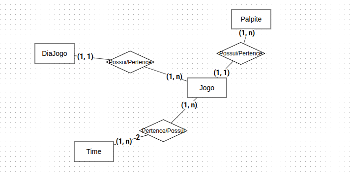

# ⚽️ Sistema de Bolão - Copa 2026

Este projeto é um sistema de bolão criado em Django, para que eu pudesse praticar e conhecer ainda mais sobre o framework, além de facilitar o bolão que tenho feito com meus amigos ao longo desta copa! 

As principais funcionalidades do sistema são:

- Cadastrar, editar e remover Time (admin)
- Cadastrar dia de jogo (admin)
- Cadastrar Jogo (admin)
- Cadastrar palpite (all users)

---

## 🛠️ Tecnologias utilizadas (em desenvolvimento localhost)

_obs: essas são a tecnologias que utilizei para desenvolver localhost. Se colocado em produção, as tecnologias tendem a mudar_

- Python 3.12.3
- Django 6.0.6
- SQLite (banco de dados padrão do Django)
- Templates Django/Bootstrap

---

## 📂 Estrutura do projeto

```bash

core/
│
├── settings.py
├── urls.py
├── asgi.py
├── wsgi.py
├── static/
├   └── imagens/
├
└── templates/
    ├── base.html
    └── login.html

campeonato/
│
├── models.py 
├── views.py
├── urls.py
├── admin.py
├── templates/
│   └── campeonato/
│       ├── home.html
│       ├── jogos.html
│       └── regras.html
│
└── static/

palpites/
│
├── models.py
├── forms.py
├── views.py
├── urls.py
├── admin.py
├── templates/
│   └── palpites/
│       ├── lista_jogos.html
│       ├── palpitar.html
│       ├── ranking.html
│       ├── palpites_fechados.html
│       └── meus_palpites.html
│
└── management/
    └── commands/
        └── recalcular_pontuacoes.py

```

_obs: decidi a criação de dois apps, campeonato e palpites. O app campeonato terá tudo referente ao campeonato(regras, todos os jogos cadastrados..), equanto o app palpite terá tudo que for atrelado aos palpites_

---

## Como rodar

0 - Clonar o repositório

```bash

git clone <url-do-repo>

cd projeto-sistema-bolao-copa

```

1 - Criar o ambiente virtual

```bash

python -m venv .venv 

.venv\Scripts\activate  #Windows
source .venv/bin/active #Linux e Mac
```

2 - Criar .env seguindo o exemplo a seguir

```bash
SECRET_KEY=SuaKey
DEBUG=True
ALLOWED_HOSTS=localhost,127.0.0.1 #Não precisa dessa linha se Debug = True

```


3 - Instalar dependencias

```bash

pip install -r requirements.txt

```

4 - Aplicar migrações

```bash
python manage.py migrate

```

5 - Criar superusuario

```bash
python manage.py createsuperuser

```

6 - Rodar servidor

```bash
python manage.py runserver

sistema diponivel em: http://127.0.0.1:8000/

painel administrativo em: http://127.0.0.1:8000/admin/

```
---

## 💻 Modelagem (regras de negócio)

Quando comecei o projeto, iniciei pela modelagem do banco (o que é comum), então nessa
etapa são definidas as entidades, relacionamento entre as tabelas e regra do negocio (regra do negocio primeiro, claro!). Isso foi feito usando o ORM do Django. 

### Entidades

- No app campeonato:

    - Time
    - DiaJogo
    - Jogo
    - Configuracao

- No app palpites:

    - Palpite
    - User (padrão do Django)


### Relacionamentos

Partindo para a parte de relacionamentos, montei um modelo conceitual do banco, onde pode ser visto de forma simples os relacionamentos adotados:




Descrevendo os relacionamentos, teremos:

- Cada DiaJogo possui n jogos e cada Jogo pertence a 1 DiaJogo

- Cada Time pertence a n jogo e cada Jogo possuí 2 Times (casa e visitante)

- Um Usuário pode registrar n palpites e cada Palpite pertence a 1 Usuário

- Cada Palpite possuí 1 Jogo e cada Jogo pertence a n Palpites


### Restrições do negócio

Algumas restrições do negócio que gostaria de compartilhar:

- Um usuário só pode registrar um palpite por jogo.

- Um time não pode jogar contra ele mesmo.

- Jogos encerrados não aceitam novos palpites.

- O administrador pode bloquear globalmente o envio de palpites.

- O cálculo da pontuação é baseado no resultado oficial da partida (colocado pelo admin).

---

## ⌨️ Navegando 
